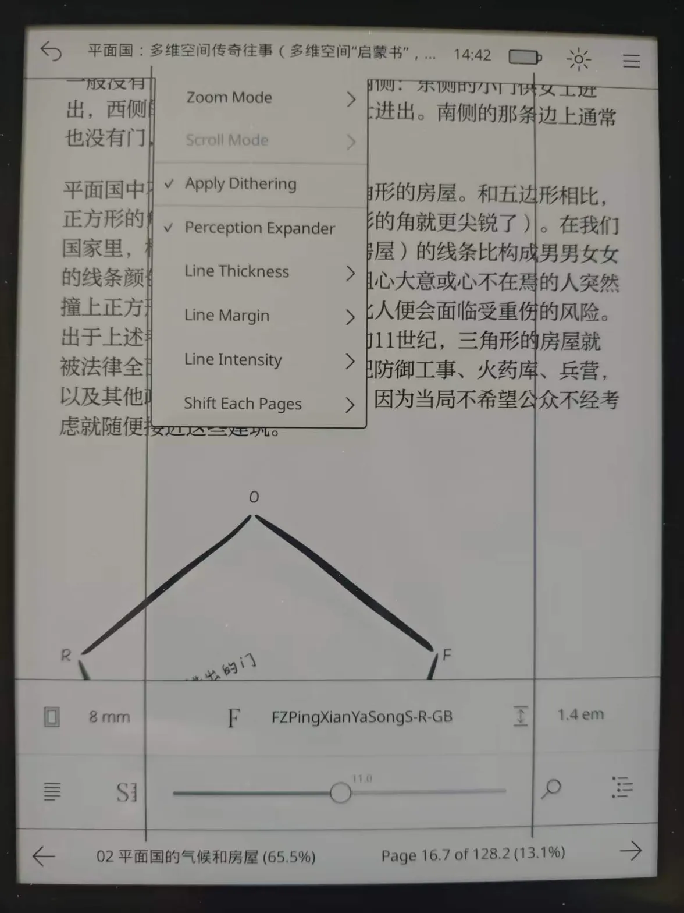

*Plato* is a document reader for *Kobo*'s e-readers.

> **Disclaimer / 声明**
> Portions of the code and documentation in this fork were generated with
> the help of the **Qwen3.8** and **DeepSeek-4.1f** language models.
> The author has verified that the shipped image works on his own devices,
> but makes **no warranty** about safety or reliability on other devices or
> firmwares; install at your own risk.
>
> 本分支的部分代码与文档由 **Qwen3.8** 与 **DeepSeek-4.1f** 模型辅助生成。
> 开发者仅在自己的设备上验证过镜像可用,**不保证**在其他设备/固件上的
> 安全性与可靠性,安装风险自负。

## Quick Reading / 快速阅读(Perception Expander / 感知扩展器)

This fork adds a **Perception Expander** overlay (port of KOReader's
Quick Reading module): two adjustable vertical lines flanking the text
block that slowly converge every N page turns. Enable and tune it from
the title menu (tap the book title while reading): thickness 1–4 px,
margin 5–30%, intensity 1–10, shift every 25/50/100/200/400 pages
(0 = off). Settings are global and persist to `Settings.toml`
(`[perception-expander]`).

本分支为 Plato 内置「**快速阅读 / 感知扩展器**」:阅读区左右两条可调竖线,
每翻 N 页向内推进。入口 = 阅读页点书名弹出的菜单底部。开关与参数保存在
`Settings.toml` 的 `[perception-expander]` 段(全局,不随书走)。

**Kobo 用户直接装现成一键包**:Releases → `OCP-Plato-0.9.45-PE.zip` →
按 NiLuJe 原版 install.sh 流程安装(见 Release 正文链接)。
构建复现:`./docker-build.sh`(容器内交叉编译,glibc ≤2.18 产物);部署:`./deploy-kobo.sh`。

Documentation: [GUIDE](doc/GUIDE.md), [MANUAL](doc/MANUAL.md) and [BUILD](doc/BUILD.md).

## Supported firmwares

Any 4.*X*.*Y* firmware, with *X* ≥ 6, will do.

## Supported devices

- *Libra Colour*.
- *Clara Colour*.
- *Clara BW*.
- *Elipsa 2E*.
- *Clara 2E*.
- *Libra 2*.
- *Sage*.
- *Elipsa*.
- *Nia*.
- *Libra H₂O*.
- *Forma*.
- *Clara HD*.
- *Aura H₂O Edition 2*.
- *Aura Edition 2*.
- *Aura ONE*.
- *Glo HD*.
- *Aura H₂O*.
- *Aura*.
- *Glo*.
- *Touch C*.
- *Touch B*.

## Donations

